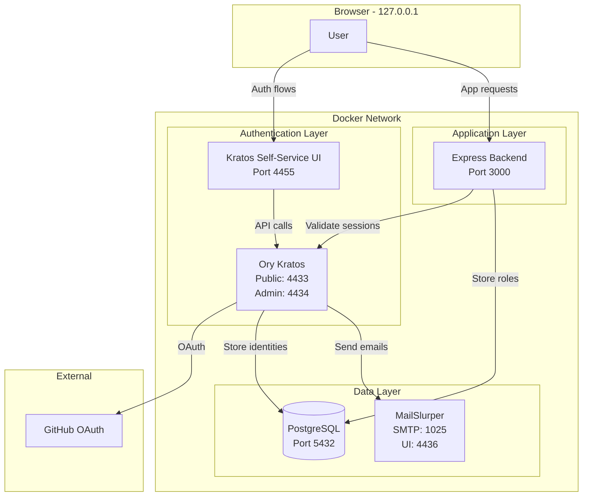
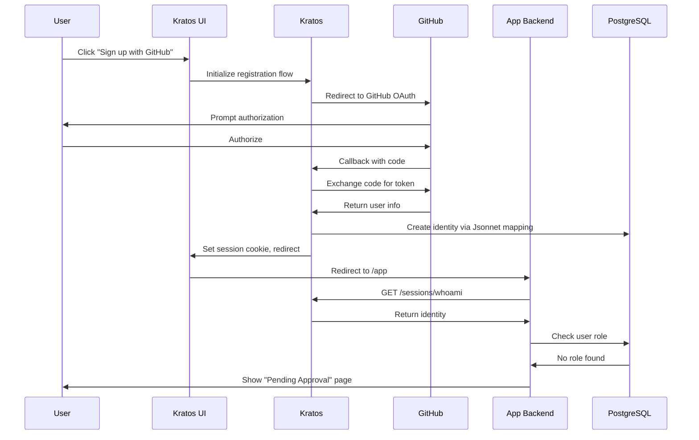
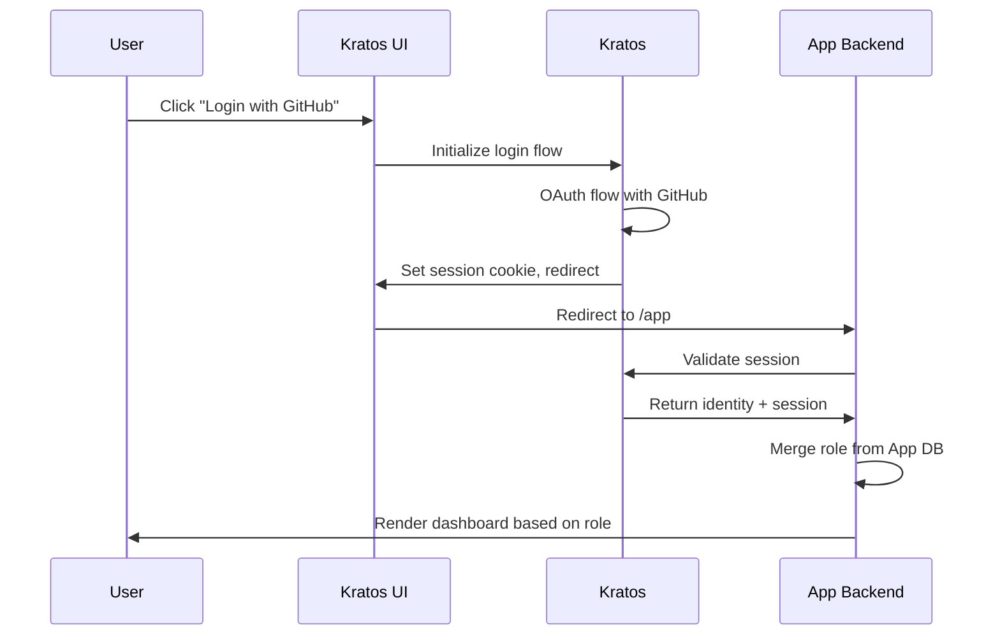
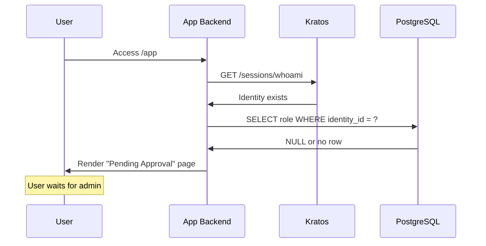

<!-- f68c2d95-bd0a-4a9b-a009-cad8f362620c 66f3519e-f4ab-44f1-b07c-a3751db08e79 -->
# Ory Kratos OAuth Web App with GitHub Authentication

## Architecture Diagram



## Boundary Definitions

| Component | Owns | Does NOT Own |

|-----------|------|--------------|

| **Ory Kratos** | Identity storage, Session management, OAuth flows, Password recovery, Email verification | Roles, Permissions, Authorization |

| **Application** | Role management (RBAC), User-role assignments, Authorization middleware, Business logic | Authentication, Session tokens, OAuth handshake |

| **Kratos UI** | Auth UI rendering (login, register, settings, recovery) | Role-based UI rendering |

## Authentication Flows

### 1. Register via GitHub



### 2. Login Flow



### 3. First Login Without Role



## Project File Structure

```
ory-kratos-oauth/
├── docker-compose.yml
├── .env.example
├── README.md
├── kratos/
│   ├── kratos.yml
│   ├── identity.schema.json
│   └── oidc.github.jsonnet
├── app/
│   ├── package.json
│   ├── Dockerfile
│   ├── src/
│   │   ├── index.ts
│   │   ├── config.ts
│   │   ├── middleware/
│   │   │   ├── auth.ts
│   │   │   └── requireRole.ts
│   │   ├── routes/
│   │   │   ├── me.ts
│   │   │   ├── admin.ts
│   │   │   └── app.ts
│   │   ├── services/
│   │   │   └── kratos.ts
│   │   ├── db/
│   │   │   ├── client.ts
│   │   │   └── migrations/
│   │   │       └── 001_create_user_roles.sql
│   │   └── views/
│   │       ├── pending.ejs
│   │       ├── dashboard.ejs
│   │       └── admin.ejs
│   └── tsconfig.json
└── scripts/
    └── seed-admin.sql
```

## Implementation Details

### 1. Docker Compose Services

- **postgres**: PostgreSQL 15 with two databases (kratos, app)
- **kratos-migrate**: One-shot container to run Kratos migrations
- **kratos**: Ory Kratos v1.1.0 with GitHub OIDC configured
- **kratos-selfservice-ui-node**: Official Node.js self-service UI
- **mailslurper**: Fake SMTP for catching verification emails
- **app**: Express.js backend with session validation and RBAC

### 2. Kratos Configuration Highlights

- `serve.public.base_url`: `http://127.0.0.1:4433/`
- `serve.admin.base_url`: `http://kratos:4434/` (internal)
- `selfservice.default_browser_return_url`: `http://127.0.0.1:3000/app`
- `cookies.same_site`: `Lax`
- `cookies.domain`: `127.0.0.1`
- GitHub OIDC provider with Jsonnet mapper

### 3. GitHub OAuth Setup Instructions

1. Go to GitHub Developer Settings → OAuth Apps → New OAuth App
2. Set Homepage URL: `http://127.0.0.1:4455`
3. Set Callback URL: `http://127.0.0.1:4433/self-service/methods/oidc/callback/github`
4. Copy Client ID and Client Secret to `.env`

### 4. App Database Schema

```sql
CREATE TYPE user_role AS ENUM ('admin', 'user');

CREATE TABLE user_roles (
    id SERIAL PRIMARY KEY,
    identity_id UUID NOT NULL UNIQUE,
    role user_role NOT NULL DEFAULT 'user',
    created_at TIMESTAMP DEFAULT NOW(),
    updated_at TIMESTAMP DEFAULT NOW()
);
```

### 5. Key API Endpoints

| Endpoint | Method | Description | Auth |

|----------|--------|-------------|------|

| `/me` | GET | Get current user + role | Session required |

| `/admin/users` | GET | List all users | Admin only |

| `/admin/users/:id/role` | POST | Assign role | Admin only |

| `/app` | GET | Main app entry, role-based routing | Session required |

### 6. Session Validation Middleware

The middleware will call Kratos `GET /sessions/whoami` with the session cookie forwarded, then merge the app-level role from PostgreSQL.

## Todos

The implementation will proceed in this order:

1. Create Docker Compose infrastructure
2. Configure Kratos with GitHub OIDC
3. Build Express backend with auth middleware
4. Implement role management API
5. Create UI views and routing logic
6. Write documentation and troubleshooting guide

### To-dos

- [ ] Create Docker Compose with Postgres, Kratos, MailSlurper, and UI services
- [ ] Configure Kratos: kratos.yml, identity schema, GitHub OIDC Jsonnet mapper
- [ ] Build Express backend with TypeScript, session middleware, and Kratos SDK
- [ ] Implement app-level RBAC: migrations, seed script, and role assignment API
- [ ] Create EJS views: pending approval, user dashboard, admin dashboard
- [ ] Write README with setup instructions, GitHub OAuth guide, and troubleshooting